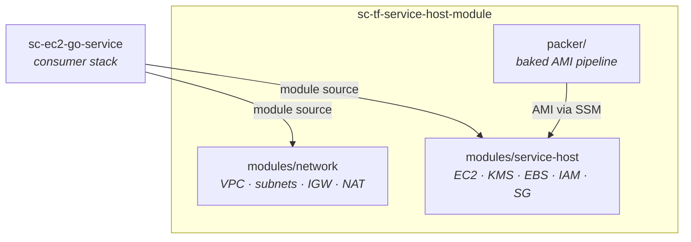

# sc-tf-service-host-module

The Terraform-side infrastructure for the EC2 service model. This is the aligned secondary deployment path: the CDK module is primary, but both paths target the same runtime model and security posture.

## Start Here

- [packer/README.md](packer/README.md) — baked AMI pipeline
- [terraform/modules/network/README.md](terraform/modules/network/README.md) — shared VPC/network module
- [terraform/modules/service-host/README.md](terraform/modules/service-host/README.md) — shared EC2 service-host module
- [`sc-ec2-go-service`](https://github.com/Bh-an/sc-ec2-go-service) — operator repo and Terraform consumer
- [`sc-cdk-service-host-module`](https://github.com/Bh-an/sc-cdk-service-host-module) — CDK source of truth for the same model

## Prerequisites

For shared module and Packer work in this repo:

- Terraform
- Packer
- AWS CLI with valid credentials

Quick local verification:

```bash
cd packer && packer init . && packer validate .
cd ../terraform && terraform init -backend=false && terraform validate
```

For real deploy/test execution, use the operator surface in [`sc-ec2-go-service`](https://github.com/Bh-an/sc-ec2-go-service):

```bash
make build-ami ENV=dev
make deploy-terraform ENV=dev
```

## What This Repo Owns

This repo owns three things:

- **Packer AMI pipeline** — bakes Docker and Nginx into Amazon Linux 2023
- **Reusable Terraform modules** — `network` and `service-host`
- **Root Terraform stack** — maintainer/reference validation stack

It does not own:

- the Go application
- the GHCR image publishing workflow
- the main operator/testing runbook

Those belong to [`sc-ec2-go-service`](https://github.com/Bh-an/sc-ec2-go-service).

## Capabilities

- baked Amazon Linux 2023 AMI pipeline with Docker and Nginx preinstalled
- shared Terraform network module for public and private subnet topologies, with optional NAT
- shared Terraform service-host module for `module-public`, `private`, and `caller-managed` exposure modes
- encrypted EC2 root and data volumes with either a module-managed KMS key or caller-provided `kms_key_arn`
- SSM-managed host access and AMI resolution from SSM or latest matching AMI name
- first-boot container bootstrap that retries transient GHCR image-pull failures before failing the host setup

## Module Relationship



---

## Directory Layout

```text
packer/                          Baked EC2 host AMI
terraform/                       Root stack for maintainer validation
terraform/modules/network/       VPC, subnets, IGW, NAT, routing
terraform/modules/service-host/  EC2, IAM, KMS, EBS, SG, Nginx, bootstrap user data
scripts/                         AMI publication helpers
```

## Configured Defaults

> [!IMPORTANT]
> **Defaults governance** — these values are load-bearing. If you change a default in code, update this table in the same commit.

| Default | Value | Source |
|---------|-------|--------|
| Instance type | `t3.micro` | `terraform/modules/service-host/variables.tf:37` |
| Root volume | **30 GiB**, GP3, encrypted | `terraform/modules/service-host/variables.tf:66` |
| Data volume | 10 GiB, GP3, encrypted | `terraform/modules/service-host/variables.tf:72` |
| Data volume device | `/dev/xvdf` | `terraform/modules/service-host/main.tf:163` |
| Exposure mode | `module-public` | `terraform/modules/service-host/variables.tf:78` |
| Elastic IP | Enabled for `module-public` | `terraform/modules/service-host/variables.tf:89` |
| KMS key rotation | Enabled | `terraform/modules/service-host/main.tf:38` |
| KMS deletion window | 7 days | `terraform/modules/service-host/main.tf:37` |
| IMDSv2 | Required | `terraform/modules/service-host/main.tf:117` |
| EBS type | GP3 | `terraform/modules/service-host/main.tf:123, 153` |
| Ingress | Exposure-derived defaults (`0.0.0.0/0`, VPC-only, or caller-managed) | `terraform/modules/service-host/locals.tf:2-19` |
| Egress | All traffic | `terraform/modules/service-host/main.tf:67-72` |
| AMI name prefix | `ec2-docker-host` | `terraform/modules/service-host/variables.tf:54` |
| AMI SSM parameter | `null` (fallback to latest AMI) | `terraform/modules/service-host/variables.tf:60` |
| NAT Gateways | Enabled by default in shared network module | `terraform/modules/network/variables.tf:46` |
| Packer region | `ap-south-1` | `packer/variables.pkr.hcl:4` |
| Packer base OS | Amazon Linux 2023, x86_64 | `packer/docker-host.pkr.hcl:18` |
| Packer SSH user | `ec2-user` | `packer/docker-host.pkr.hcl:26` |

> [!NOTE]
> Root volume is 30 GiB here and in the current CDK source line. This keeps the default host storage contract aligned across both deployment paths and avoids the baked-AMI snapshot mismatch seen during AWS testing.

## Shared Module Behaviors

### AMI Resolution

The service-host module resolves its AMI in priority order:

1. SSM parameter
2. latest matching AMI by `ami_name_prefix`

The SSM path is preferred for real deployments because it pins a tested AMI ID rather than always picking the newest build.

### Exposure Modes

The `service-host` module supports the same deployment postures as the CDK module:

- `module-public`
- `private`
- `caller-managed`

The `network` module exposes `enable_nat_gateways` so public-only deployments can skip NAT cost while private-host deployments can still opt into egress.

## Current Release

`v0.3.7`

> [!NOTE]
> This release line includes the Terraform validation fix for `ingress_rules = null` and the first-boot image-pull retry change. The public Terraform deploy workflow was re-verified from the service repo on `2026-03-29`.

## Contributing

See [CONTRIBUTING.md](CONTRIBUTING.md).
